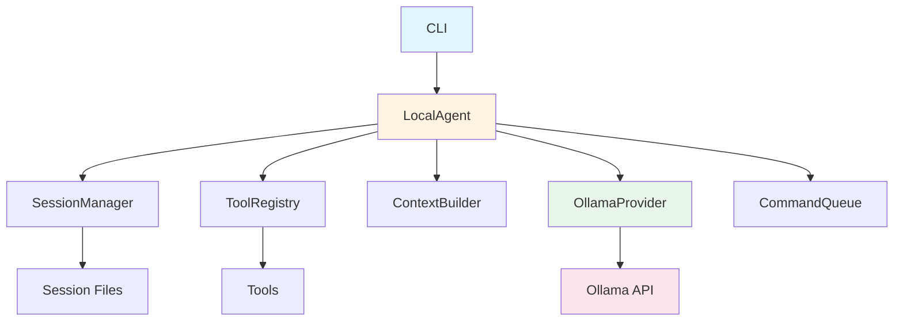

# Local Agent - 项目学习文档

> 📚 这是一个教学性质的文档，旨在帮助你理解 Local Agent 项目的架构和设计思想

---

## 目录

1. [项目概述](#1-项目概述)
2. [核心概念](#2-核心概念)
3. [架构设计](#3-架构设计)
4. [模块详解](#4-模块详解)
5. [数据流](#5-数据流)
6. [扩展指南](#6-扩展指南)
7. [最佳实践](#7-最佳实践)

---

## 1. 项目概述

### 1.1 什么是 Local Agent？

**Local Agent** 是一个简化的本地 AI Agent 框架，灵感来源于 OpenClaw 项目。它允许你使用本地部署的开源大模型（通过 Ollama）构建智能助手。

### 1.2 核心特性

- ✅ **完全本地运行**：所有数据都在本地，无需联网
- ✅ **模块化设计**：易于理解和扩展
- ✅ **工具系统**：Agent 可以调用工具执行实际任务
- ✅ **会话管理**：自动管理对话历史和上下文
- ✅ **本地服务**：通过 HTTP API 集成自定义服务
- ✅ **教学导向**：详细的注释和文档

### 1.3 与 OpenClaw 的关系

```
OpenClaw (完整版)          Local Agent (教学版)
├── 多通道支持             ├── 单一 CLI 接口
├── 云 LLM 集成            ├── 仅本地 Ollama
├── 复杂权限系统           ├── 简化的工具策略
├── Web UI                 ├── 纯 CLI
└── 生产级代码             └── 教学级代码（注释丰富）
```

---

## 2. 核心概念

### 2.1 Agent（代理）

**Agent** 是一个能够感知环境、做出决策并执行动作的智能体。

与传统聊天机器人的区别：

| 特性 | 传统聊天机器人 | AI Agent |
|------|--------------|----------|
| 能力 | 只能生成文本 | 可以执行动作 |
| 交互 | 单轮对话 | 多轮对话 + 工具调用 |
| 记忆 | 无上下文 | 完整的会话历史 |
| 目标 | 回答问题 | 完成任务 |

### 2.2 Function Calling（函数调用）

Function Calling 是 LLM 的一个重要特性，允许模型：

1. **理解**何时需要调用工具
2. **生成**符合工具定义的参数
3. **处理**工具返回的结果

工作流程：

```
用户消息
  ↓
LLM 分析 → 需要调用工具
  ↓
生成工具调用 → {"name": "read", "arguments": {"filepath": "TODO.md"}}
  ↓
执行工具 → 返回文件内容
  ↓
LLM 基于工具结果 → 生成最终回复
```

### 2.3 会话（Session）

会话是一次完整的对话记录，包括：

- **用户消息**：用户的输入
- **助手回复**：AI 的响应
- **工具调用**：AI 调用的工具记录
- **工具结果**：工具执行的返回值

会话管理的挑战：

1. **上下文窗口限制**：LLM 有固定的 token 限制
2. **Token 计算**：需要估算 token 使用量
3. **历史压缩**：当对话过长时需要压缩历史
4. **持久化**：需要保存到文件供后续查询

### 2.4 工具（Tools）

工具是 Agent 可以调用的函数，例如：

| 工具名 | 功能 | 示例用途 |
|--------|------|---------|
| `read` | 读取文件 | 查看代码、配置文件 |
| `write` | 写入文件 | 创建新文件 |
| `edit` | 编辑文件 | 修改特定内容 |
| `exec` | 执行命令 | 运行脚本、测试 |
| `local_service` | 调用本地服务 | 访问自定义 API |

### 2.5 上下文构建（Context Building）

上下文是传递给 LLM 的所有信息，包括：

```
系统提示词
  ├─ 身份声明：你是谁
  ├─ 工具列表：你可以做什么
  ├─ 工作区信息：你的工作目录
  ├─ 引导文件：项目特定规则
  └─ 运行时信息：环境元数据
  +
历史消息
  ├─ 用户之前的消息
  ├─ AI 之前的回复
  └─ 工具调用和结果
  +
当前用户消息
```

---

## 3. 架构设计

### 3.1 整体架构

```
┌─────────────────────────────────────────┐
│           CLI Interface                 │
│  (cli.js - 命令行入口)                  │
└────────────────┬────────────────────────┘
                 │
┌────────────────▼────────────────────────┐
│         Core Agent                      │
│  (agent.js - 主运行器)                  │
│                                         │
│  ┌──────────────┐  ┌─────────────────┐ │
│  │ Session Mgr  │  │ Tool Registry   │ │
│  └──────────────┘  └─────────────────┘ │
│  ┌──────────────┐  ┌─────────────────┐ │
│  │ Context Bldr │  │ Command Queue   │ │
│  └──────────────┘  └─────────────────┘ │
└────────────────┬────────────────────────┘
                 │
┌────────────────▼────────────────────────┐
│      Provider Layer                      │
│  (ollama.js - LLM 适配器)               │
└────────────────┬────────────────────────┘
                 │
┌────────────────▼────────────────────────┐
│         Ollama API                       │
│  (http://localhost:11434)               │
└─────────────────────────────────────────┘
```

### 3.2 模块关系



### 3.3 目录结构

```
local-agent/
├── cli.js                 # CLI 入口
├── package.json           # 项目配置
│
├── config/
│   └── agent.yaml         # Agent 配置文件
│
├── src/
│   ├── core/              # 核心模块
│   │   ├── agent.js       # Agent 主运行器
│   │   ├── session.js     # 会话管理器
│   │   └── queue.js       # 命令队列
│   │
│   ├── providers/         # LLM 提供商
│   │   └── ollama.js      # Ollama 适配器
│   │
│   ├── tools/             # 工具系统
│   │   └── registry.js    # 工具注册表
│   │
│   ├── prompts/           # 提示词构建
│   │   └── context.js     # 上下文构建器
│   │
│   └── services/          # 示例本地服务
│       ├── file-system.js # 文件系统服务
│       └── notes.js       # 笔记服务
│
├── workspace/             # 工作区
│   ├── skills/            # 技能目录
│   ├── memory/            # 记忆存储
│   └── CLAUDE.md          # 项目指令
│
├── sessions/              # 会话存储
│   └── {sessionId}.jsonl  # 会话文件
│
├── docs/                  # 文档
│   ├── LEARNING.md        # 学习文档（本文件）
│   └── USAGE.md           # 使用文档
│
└── examples/              # 示例代码
    └── basic-test.js      # 基础测试
```

---

## 4. 模块详解

### 4.1 命令队列 (Command Queue)

**文件**: `src/core/queue.js`

#### 为什么需要队列？

1. **防止并发冲突**：同一会话的多个请求可能同时修改会话状态
2. **保证顺序**：确保消息按顺序处理
3. **资源控制**：限制并发数，避免系统过载

#### 工作原理

```javascript
// 用户发送消息 A
agent.run({ sessionId: 'user-1', message: 'A' })
  → 加入队列 user-1

// 用户立即发送消息 B
agent.run({ sessionId: 'user-1', message: 'B' })
  → 加入队列 user-1，等待 A 完成

// 队列串行执行：
//   1. 执行 A（包含所有工具调用）
//   2. 执行 B（包含所有工具调用）
```

#### 关键代码

```javascript
// 将任务加入队列
await queue.enqueue('session-1', async () => {
  // 这个函数会按顺序执行
  const result = await doSomeWork();
  return result;
});
```

---

### 4.2 会话管理器 (Session Manager)

**文件**: `src/core/session.js`

#### 核心职责

1. **存储消息历史**：内存 + 文件双重存储
2. **Token 估算**：粗略计算 token 使用量
3. **上下文检查**：检测是否超出窗口
4. **历史压缩**：自动压缩长对话

#### 存储格式

```jsonl
{"role":"user","content":"Hello"}
{"role":"assistant","content":"Hi there!"}
{"role":"user","content":"Create a TODO list"}
{"role":"assistant","content":"Sure!","toolCalls":[...]}
{"role":"tool","content":"TODO.md created","toolCallId":"123"}
{"role":"assistant","content":"Done! TODO list created."}
```

#### Token 估算

```javascript
estimateTokens(messages) {
  // 粗略估计：4 个字符 = 1 token
  // 英文：约 4 字符/token
  // 中文：约 1.5-2 汉字/token
  // 代码：约 3-4 字符/token
  return Math.ceil(totalChars / 4);
}
```

#### 压缩策略

```javascript
// 当使用超过 90% 时触发压缩
if (usage > 0.9) {
  await session.compact({
    provider: ollama,
    systemPrompt: prompt,
    recentCount: 20,  // 保留最近 20 条消息
  });
}

// 压缩过程：
// 1. 将历史消息分为：旧消息 + 最近消息
// 2. 用 LLM 总结旧消息
// 3. 用摘要替换旧消息
// 4. 保留最近消息不变
```

---

### 4.3 Ollama 适配器 (Ollama Provider)

**文件**: `src/providers/ollama.js`

#### 核心功能

1. **聊天补全**：流式生成文本
2. **文本生成**：单次生成（用于摘要）
3. **文本嵌入**：生成向量（用于语义搜索）

#### 流式响应处理

```javascript
async *chat(messages, tools) {
  const response = await fetch('/api/chat', {
    method: 'POST',
    body: JSON.stringify({ messages, tools, stream: true }),
  });

  const reader = response.body.getReader();
  const decoder = new TextDecoder();
  let buffer = '';

  while (true) {
    const { done, value } = await reader.read();
    if (done) break;

    buffer += decoder.decode(value, { stream: true });
    const lines = buffer.split('\n');
    buffer = lines.pop(); // 保留不完整的行

    for (const line of lines) {
      const data = JSON.parse(line);
      if (data.message?.content) {
        yield { content: data.message.content };
      }
      if (data.message?.tool_calls) {
        yield { toolCalls: data.message.tool_calls };
      }
    }
  }
}
```

#### 使用示例

```javascript
// 调用 LLM
for await (const chunk of ollama.chat({
  messages: [{ role: 'user', content: 'Hello' }],
  tools: toolRegistry.toLLMFormat(),
})) {
  if (chunk.content) {
    process.stdout.write(chunk.content); // 实时显示
  }
  if (chunk.toolCalls) {
    console.log('Tool calls:', chunk.toolCalls);
  }
}
```

---

### 4.4 工具系统 (Tool Registry)

**文件**: `src/tools/registry.js`

#### 工具定义

每个工具需要实现：

```javascript
class MyTool extends Tool {
  name = 'my_tool';                    // 工具名称
  description = 'Does something';      // 工具描述

  // JSON Schema 格式的参数定义
  getSchema() {
    return {
      type: 'object',
      properties: {
        param1: {
          type: 'string',
          description: 'Parameter 1',
        },
      },
      required: ['param1'],
    };
  }

  // 执行逻辑
  async execute(args) {
    const { param1 } = args;
    // 执行操作...
    return 'Result';
  }
}
```

#### 工具注册

```javascript
const registry = new ToolRegistry(config);

// 注册核心工具
await registry.registerCoreTools();
// → 注册：read, write, edit, exec

// 注册本地服务工具
await registry.registerLocalServiceTools();
// → 注册：local_file_system, local_database, ...

// 自定义工具
registry.register(new MyTool());
```

#### 工具执行流程

```javascript
// 1. LLM 生成工具调用
const toolCall = {
  name: 'read',
  arguments: { filepath: 'TODO.md' }
};

// 2. 执行工具
const result = await registry.execute(
  toolCall.name,
  toolCall.arguments
);

// 3. 将结果添加到会话
await session.addMessage({
  role: 'tool',
  content: result,
  toolCallId: toolCall.id,
});
```

---

### 4.5 上下文构建器 (Context Builder)

**文件**: `src/prompts/context.js`

#### 构建过程

```javascript
const systemPrompt = await contextBuilder.build({
  mode: 'full',              // full | minimal | none
  toolNames: ['read', 'write', 'exec'],
  thinkingLevel: 'medium',
});
```

#### 生成的系统提示词结构

```markdown
# Identity
You are a local AI assistant...

# Available Tools
- read: Read file contents
- write: Write to files
...

# Workspace
Your working directory is: ./workspace

# Local Services
- local_file_system: File operations (http://localhost:3001/api)

# Project Context
## CLAUDE.md
(项目指令内容)

## AGENTS.md
(Agent 行为规范)

# Thinking
Think step by step...

# Memory
Use memory_search before answering...

# Silent Replies
When nothing to say, respond: NO_REPLY

# Runtime Information
- Date: ...
- Model: llama3.1:8b
...
```

---

## 5. 数据流

### 5.1 完整的请求流程

```
1. 用户发送消息
   "帮我创建一个 TODO 列表"
      ↓
2. CLI 接收消息
   cli.js → agent.run()
      ↓
3. 加入队列
   queue.enqueue('session-1', ...)
      ↓
4. 获取/创建会话
   SessionManager.load()
      ↓
5. 检查上下文窗口
   session.checkContextWindow()
   if exceeded → session.compact()
      ↓
6. 构建系统提示词
   contextBuilder.build()
      ↓
7. 添加用户消息
   session.addMessage({ role: 'user', content: ... })
      ↓
8. 调用 LLM
   ollama.chat({ messages, tools })
      ↓
9. LLM 决定调用工具
   { toolCalls: [{ name: 'write', arguments: {...} }] }
      ↓
10. 执行工具
    toolRegistry.execute('write', {...})
      ↓
11. 添加工具结果
    session.addMessage({ role: 'tool', content: ... })
      ↓
12. 再次调用 LLM
    ollama.chat({ messages + toolResult })
      ↓
13. LLM 生成最终回复
    { content: "已创建 TODO 列表！" }
      ↓
14. 添加助手回复
    session.addMessage({ role: 'assistant', content: ... })
      ↓
15. 返回给用户
    "已创建 TODO 列表！"
```

### 5.2 推理循环

```javascript
async runInferenceLoop(params) {
  let iteration = 0;
  const maxIterations = 10;

  while (iteration < maxIterations) {
    iteration++;

    // 1. 调用 LLM
    const response = await ollama.chat({
      messages: session.getMessages(),
      tools: tools.toLLMFormat(),
    });

    // 2. 检查是否有工具调用
    if (response.toolCalls.length === 0) {
      return response.content; // 没有，返回回复
    }

    // 3. 执行工具
    for (const call of response.toolCalls) {
      const result = await tools.execute(call.name, call.arguments);
      session.addMessage({ role: 'tool', content: result });
    }

    // 4. 继续循环（让 LLM 基于工具结果生成回复）
  }
}
```

---

## 6. 扩展指南

### 6.1 添加新工具

#### 步骤 1: 定义工具类

```javascript
// src/tools/my-custom-tool.js
import { Tool } from './registry.js';

export class MyCustomTool extends Tool {
  name = 'my_custom_tool';
  description = 'Does something useful';

  getSchema() {
    return {
      type: 'object',
      properties: {
        input: {
          type: 'string',
          description: 'Input parameter',
        },
      },
      required: ['input'],
    };
  }

  async execute(args) {
    const { input } = args;
    // 执行你的逻辑
    return `Processed: ${input}`;
  }
}
```

#### 步骤 2: 注册工具

```javascript
// src/core/agent.js
import { MyCustomTool } from '../tools/my-custom-tool.js';

async initialize() {
  // ...
  this.tools.register(new MyCustomTool());
}
```

#### 步骤 3: 更新配置

```yaml
# config/agent.yaml
agent:
  tools:
    allow:
      - read
      - write
      - my_custom_tool  # 添加到允许列表
```

---

### 6.2 添加本地服务

#### 步骤 1: 创建服务

```javascript
// src/services/my-service.js
import express from 'express';
import cors from 'cors';

export async function startMyService(options = {}) {
  const port = options.port || 3005;

  const app = express();
  app.use(cors());
  app.use(express.json());

  // 健康检查
  app.get('/api/health', (req, res) => {
    res.json({ service: 'my-service', status: 'ok' });
  });

  // 自定义端点
  app.post('/api/do-something', (req, res) => {
    const { param } = req.body;
    // 处理请求...
    res.json({ success: true, data: 'result' });
  });

  return new Promise((resolve) => {
    app.listen(port, () => {
      console.log(`My service running on port ${port}`);
      resolve({ app });
    });
  });
}
```

#### 步骤 2: 更新配置

```yaml
# config/agent.yaml
agent:
  localServices:
    - name: "my_service"
      endpoint: "http://localhost:3005/api"
      description: "My custom service"
```

---

### 6.3 自定义系统提示词

#### 方法 1: 修改代码

```javascript
// src/prompts/context.js
getBaseSection() {
  return `# Identity
You are a custom AI assistant with special behavior...`;
}
```

#### 方法 2: 使用引导文件

```markdown
<!-- workspace/CLAUDE.md -->
# Custom Instructions

This is a custom instruction for the AI.
- Use this style when responding
- Always do X before Y
```

---

### 6.4 添加技能（Skills）

```
workspace/skills/
├── my-skill/
│   └── SKILL.md
│       # Skill: My Custom Skill
│       When to use: ...
│       How to use: ...
│       Examples: ...
```

---

## 7. 最佳实践

### 7.1 工具设计

✅ **好的工具**:
- 名称清晰，描述准确
- 参数最少化，只包含必需的
- 返回简洁的结果
- 错误处理完善

❌ **不好的工具**:
- 名称模糊
- 参数过多
- 返回冗长信息
- 错误处理缺失

### 7.2 提示词编写

✅ **好的系统提示词**:
- 清晰的角色定位
- 明确的任务描述
- 详细的约束条件
- 具体的输出格式

❌ **不好的系统提示词**:
- 角色模糊
- 任务不明确
- 约束缺失
- 格式混乱

### 7.3 会话管理

✅ **好的实践**:
- 定期检查 token 使用
- 及时压缩长对话
- 合理设置上下文窗口
- 持久化重要会话

❌ **不好的实践**:
- 忽略 token 限制
- 不压缩历史
- 窗口设置过大或过小
- 不持久化会话

### 7.4 错误处理

✅ **好的错误处理**:
- 捕获所有异常
- 提供清晰的错误信息
- 优雅降级
- 记录错误日志

❌ **不好的错误处理**:
- 忽略异常
- 错误信息模糊
- 直接崩溃
- 无日志记录

---

## 8. 学习路径

### 初学者

1. 阅读「项目概述」和「核心概念」
2. 运行基础测试：`node examples/basic-test.js`
3. 使用 CLI 交互：`node cli.js`
4. 尝试修改系统提示词

### 中级

1. 阅读「架构设计」和「模块详解」
2. 理解数据流程
3. 添加一个自定义工具
4. 创建一个本地服务

### 高级

1. 深入研究推理循环
2. 优化上下文压缩策略
3. 实现记忆系统
4. 集成更多 LLM 提供商

---

## 9. 常见问题

### Q1: 为什么要使用队列？

**A**: 队列确保同一会话的消息按顺序处理，避免状态竞争。例如，如果用户连续发送两条消息，没有队列可能导致工具调用顺序混乱。

### Q2: Token 估算为什么不准确？

**A**: Token 估算是一个粗略的方法。准确的 token 计数需要使用 tokenizer（tiktoken），但需要额外依赖。粗略估计在大多数情况下足够使用。

### Q3: 什么时候需要压缩会话？

**A**: 当会话 token 使用量超过上下文窗口的 90% 时，应该压缩。这样可以避免下次请求时超出限制。

### Q4: 如何调试工具调用？

**A**:
1. 查看日志输出（工具执行时会有日志）
2. 检查工具的 `getSchema()` 是否正确
3. 确认参数格式是否匹配
4. 使用 `sessions` 命令查看会话历史

### Q5: 可以使用其他 LLM 提供商吗？

**A**: 可以！参考 `src/providers/ollama.js`，创建新的适配器。需要实现 `chat()` 方法，支持流式输出和工具调用。

---

## 10. 资源链接

- **Ollama**: https://ollama.ai
- **Ollama API 文档**: https://github.com/ollama/ollama/blob/main/docs/api.md
- **Function Calling**: https://platform.openai.com/docs/guides/function-calling
- **JSON Schema**: https://json-schema.org/
- **OpenClaw 项目**: (本项目灵感的来源)

---

## 结语

希望这份学习文档能帮助你理解 Local Agent 的设计思想。如有疑问，欢迎查看代码注释或提出问题！

**记住**：最好的学习方式是动手实践。尝试修改代码、添加功能，你会发现这比单纯阅读更有收获。

🚀 Happy Coding!
